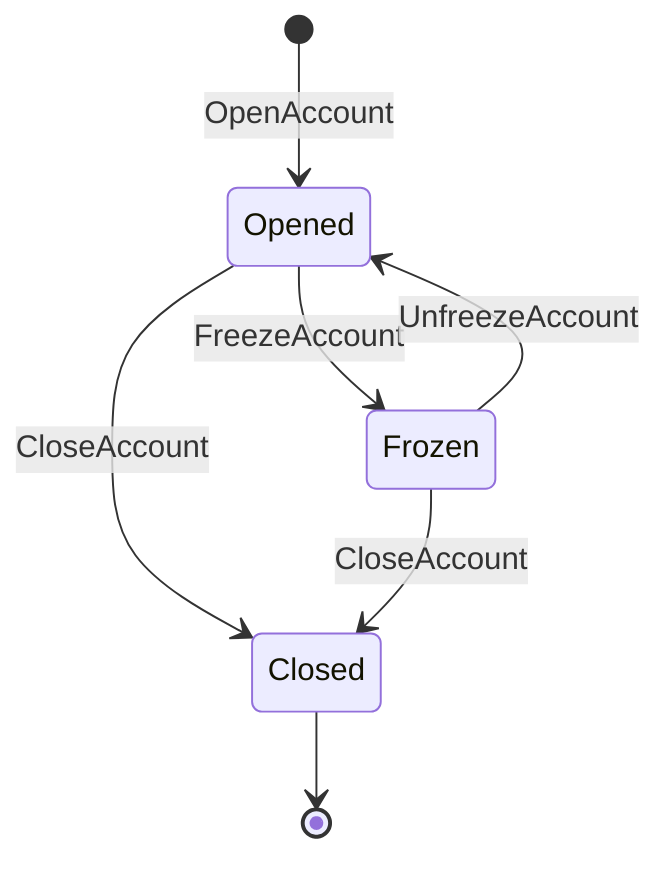

# Aggregate Design Canvas (v1.1)

An aggregate is a graph of objects that forms a consistency boundary for domain policies. It is a lifecycle pattern described by Eric Evans. The boundaries of aggregates impact behaviours modelled within the domain, so designing them well is critical.

The canvas has a suggested order of working through it that helps to iteratively discuss different aspects of the aggregate design.

## Sections

### 1. Name

Clear, semantic name of the aggregate root. In some domains, include the cycle length or lifespan indicator as part of the name.

**Examples**: `Order`, `BankAccount`, `BillingPeriod-Monthly`, `ConferenceBooking`.

### 2. Description

Summarise the main responsibilities and business purpose. Include the reasons why these boundaries were chosen and the trade-offs compared to alternative designs.

### 3. State Transitions

Explicit transitions between valid states. Too many transitions may indicate process boundaries were not modelled properly and can be split. Very naive or simple transitions may indicate an anaemic aggregate with logic pushed out to services.

**Output format**: List of states + Mermaid `stateDiagram-v2`.

### 4. Enforced Invariants

Business rules that MUST hold true before any state change. Every command MUST pass through invariant checks before updating state.

**Logic flow**: Command → Invariant Check → State Update → Domain Event.

Listing invariants makes the aggregate's responsibilities explicit. A large number of enforced invariants can indicate high local complexity.

### 5. Corrective Policies

When aggregate boundaries are relaxed (e.g., to reduce concurrency conflicts), some invariants become eventually consistent. Corrective policies handle those inconsistencies after the fact.

A large number of corrective policies may indicate business logic was pushed outside the aggregate, increasing implementation complexity.

Listing both Invariants and Corrective Policies on the canvas makes design trade-offs explicit.

### 6. Handled Commands

All commands the aggregate is capable of handling. Each command triggers invariant checks and produces state changes.

### 7. Created Events

All domain events produced as a result of handling commands. Create connectors between Commands and Events to validate nothing is missing.

**Output format for sections 6 + 7**: Table mapping commands to events.

| Command | Resulting Event | State Change |
|---|---|---|
| OpenAccount | AccountOpened | → Opened |
| DepositMoney | MoneyDeposited | balance += amount |
| WithdrawMoney | MoneyWithdrawn | balance -= amount |
| FreezeAccount | AccountFrozen | → Frozen |
| CloseAccount | AccountClosed | → Closed |

### 8. Throughput

Estimate how likely a single aggregate instance will be involved in concurrency conflicts. For each metric, estimate **Average** and **Maximum** to reason about outliers.

| Metric | Average | Maximum |
|---|---|---|
| Command handling rate | e.g., 1/day | e.g., 10/min |
| Total number of clients | e.g., 1 | e.g., 3 |
| **Concurrency conflict chance** | **Low** | **Medium** |

**Heuristic**: Plot Average and Maximum on a 2D chart (Command Rate × Clients) to visualize conflict chance. Bigger aggregates have higher conflict chance but fewer corrective policies.

- **Low conflict**: Single client, low command rate (e.g., user's shopping basket).
- **High conflict**: Many clients, high command rate (e.g., conference ticket booking).

### 9. Size

Estimate the hypothetical size measured in number of events per aggregate instance. Events can be fine-grained (`LineItemAdded`) or coarse-grained (`OrderCreated` with embedded items). Coarse-grained events produce larger aggregate size even with fewer events.

| Metric | Average | Maximum |
|---|---|---|
| Event growth rate | e.g., 5/day | e.g., 50/day |
| Lifetime of single instance | e.g., 30 days | e.g., 365 days |
| **Total events persisted** | **~150** | **~18,250** |

**Heuristics**:
- Medium/large event counts may impact performance. Use snapshots to mitigate.
- Long-lived (potentially infinite) instances cause archiving problems. Scope to a time period (e.g., billing period).

## Heuristics for Analysis

- **Rule of One**: One aggregate per transaction. If two rules must be atomic, they belong in the same aggregate.
- **Large aggregates**: More than 5 entities or 100+ events per lifetime should be evaluated for splitting.
- **Concurrency vs Consistency**: Bigger aggregates = stronger consistency but higher conflict chance. Smaller aggregates = lower conflict but more corrective policies.
- **Anaemic check**: If the aggregate has few invariants and state transitions, logic may have leaked to services.
- **Process boundaries**: Too many state transitions may indicate multiple processes collapsed into one aggregate.

## Complete Example: Naive Bank Account

### 1. Name
**BankAccount**

### 2. Description
Manages the lifecycle of a single bank account, enforcing balance and overdraft rules. Boundaries chosen to guarantee atomic balance operations.

### 3. State Transitions

### 4. Enforced Invariants
- Balance MUST NOT go below the overdraft limit.
- A frozen account MUST NOT accept deposits or withdrawals.
- A closed account MUST NOT accept any commands.

### 5. Corrective Policies
- If a scheduled payment fails due to insufficient funds, notify the account holder and retry after 24h.

### 6–7. Commands → Events

| Command | Resulting Event | State Change |
|---|---|---|
| OpenAccount | AccountOpened | → Opened |
| DepositMoney | MoneyDeposited | balance += amount |
| WithdrawMoney | MoneyWithdrawn | balance -= amount |
| FreezeAccount | AccountFrozen | → Frozen |
| UnfreezeAccount | AccountUnfrozen | → Opened |
| CloseAccount | AccountClosed | → Closed |

### 8. Throughput

| Metric | Average | Maximum |
|---|---|---|
| Command handling rate | 2/day | 20/min |
| Total number of clients | 1 | 2 |
| **Concurrency conflict chance** | **Low** | **Low-Medium** |

### 9. Size

| Metric | Average | Maximum |
|---|---|---|
| Event growth rate | 2/day | 20/day |
| Lifetime | 5 years | 50 years |
| **Total events** | **~3,650** | **~365,000** |

**Note**: Long-lived instance. Consider scoping to yearly periods (e.g., `BankAccount-2026`) or using snapshots.
