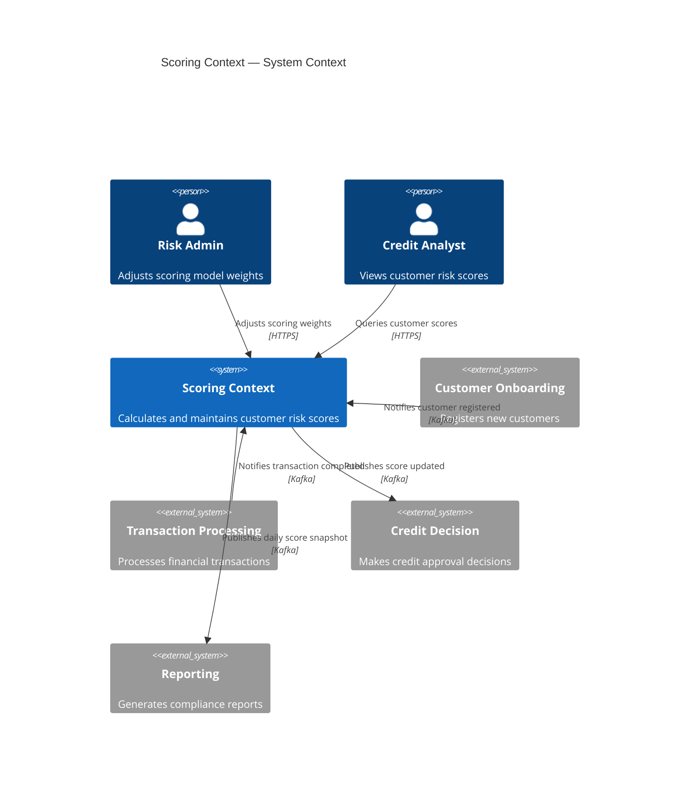
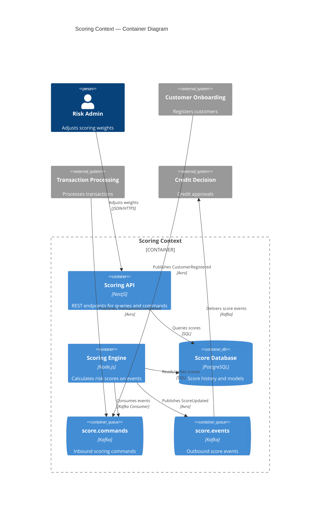

# Bounded Context Canvas (v5)

Collaborative tool for designing and documenting the design of a single bounded context. The canvas guides you through the process by requiring you to consider and make choices about the key elements of its design, from naming to responsibilities, to its public interface and dependencies.

## Sections

### 1. Name

Unique, semantic identifier for the context. Naming is hard — writing it down and gaining team agreement frames how you design the context.

**Examples**: `Billing`, `Shipping`, `Scoring`, `Advertising Campaign Engine`.

### 2. Purpose

A few sentences describing the **why** and **what** of the context in business language. No technical details. Describe from a business perspective and name key actors for whom the context provides value.

Writing down the purpose forces you to articulate fuzzy thoughts and ensures everybody on the team is on the same page.

### 3. Strategic Classification

Three dimensions to classify the context:

**Domain classification** — How important is this context to the organisation?
- **Core domain**: A key strategic initiative and differentiator.
- **Supporting domain**: Necessary but not a differentiator.
- **Generic**: A common capability found in many domains.

**Business model** — What role does the context play?
- **Revenue generator**: People pay directly for this.
- **Engagement creator**: Users like it but don't pay for it.
- **Compliance enforcer**: Protects business reputation and existence.
- **Cost reduction**: Reduces operational costs.

**Evolution** (Wardley Maps) — How evolved is the concept?
- **Genesis**: New, unexplored domain.
- **Custom built**: Companies are building their own versions.
- **Product**: Off-the-shelf versions exist with differentiation.
- **Commodity**: Highly standardised versions exist.

For help filling this section, see [Core Domain Charts](https://github.com/ddd-crew/core-domain-charts).

### 4. Domain Roles

How can you characterise the behaviour of this bounded context? Identifying roles helps avoid coupling responsibilities. Choose from these archetypes:

| Role | Heuristic |
|---|---|
| **Specification / Draft Model** | Produces a document describing a job/request to be performed. |
| **Execution Model** | Performs or tracks a job. |
| **Analysis / Audit Model** | Monitors the execution. |
| **Approver** | Receives requests and determines if they should progress. |
| **Enforcer** | Ensures other contexts carry out certain operations. |
| **Octopus Enforcer** | Ensures multiple/all contexts comply with a standard rule. |
| **Interchanger** | Translates between multiple ubiquitous languages. |
| **Gateway** | Sits at the edge managing inbound and/or outbound communication. |
| **Gateway Interchange** | Combination of a gateway and an interchanger. |
| **Dogfood Context** | Simulates the customer experience of using core bounded contexts. |
| **Bubble Context** | Sits in front of legacy contexts providing a new, cleaner model. |
| **Autonomous Bubble** | Bubble context with its own data store, syncs asynchronously with legacy. |
| **Brain Context** ⚠️ | Contains many important rules and many contexts depend on it. Likely anti-pattern. |
| **Funnel Context** | Receives documents from multiple upstream contexts, passes to single downstream in standard format. |
| **Engagement Context** | Provides key features that attract users to keep using the product. |

### 5. Inbound Communication

Collaborations initiated by other collaborators toward this context.

**Message types**:
- **Command** (blue): A request to do something.
- **Query** (green): A request for information.
- **Event** (yellow): A notification that something has happened.

**Collaborator types**:
- **Direct user interaction**: The BC owns its UI (e.g., micro-frontend).
- **Other bounded contexts**: Internal system collaborators.
- **External systems**: Third-party integrations.

**Output format**: Swimlanes grouped by collaborator.

| Collaborator | Message | Type | Relationship |
|---|---|---|---|
| Order Context | PlaceOrder | Command | Customer-Supplier |
| Payment Gateway | PaymentReceived | Event | ACL |
| Dashboard (UI) | GetScoreSummary | Query | Direct user interaction |

### 6. Outbound Communication

Collaborations initiated by this context toward other collaborators. Same message types and notation as inbound.

| Collaborator | Message | Type | Relationship |
|---|---|---|---|
| Notification Context | ScoreCalculated | Event | Published Language |
| Reporting Context | DailyScoreReport | Query | Open Host Service |

### Relationship Types (Context Mapping)

| Relationship | Description |
|---|---|
| **Customer-Supplier** | Downstream has veto power on upstream changes. |
| **Conformist** | Downstream conforms to upstream model with no negotiation. |
| **Anti-Corruption Layer (ACL)** | Downstream translates upstream model to protect its own model. |
| **Open Host Service (OHS)** | Upstream provides a well-defined protocol for any downstream consumer. |
| **Published Language (PL)** | A shared, documented language (often paired with OHS). |
| **Partnership** | Two contexts cooperate on integration, both teams plan together. |
| **Shared Kernel** | Two contexts share a small, explicitly defined subset of the model. |
| **Separate Ways** | No integration — each context solves the problem independently. |

### 7. Ubiquitous Language

Key domain terms and their precise definitions within this context. Terms may have different meanings in other contexts.

| Term | Definition |
|---|---|
| Score | Numeric value representing... |
| Assessment | The process of evaluating... |

### 8. Business Decisions

Key business rules and policies enforced within this context.

### 9. Assumptions

Design decisions made without full knowledge. Making assumptions explicit helps the team revisit them as knowledge grows.

### 10. Verification Metrics

Metrics to validate whether the chosen boundaries are a good fit. Collect from CI/CD, JIRA, or live systems. Think build-measure-learn.

**Examples**: Deployment frequency, lead time for changes, coupling metrics between contexts, number of cross-context calls.

### 11. Open Questions

Unresolved issues identified during modelling. Many open questions indicate high uncertainty about the design.

## Interface Design Tips

1. Are the names of messages coherent with each other and the description of the context?
2. Is each message type optimal (e.g., should a command be an event)?
3. Is the interface too big (too many unique message types)?
4. Is the context exposing too much of its internals?
5. Do any messages seem like they should belong elsewhere?
6. Experiment by moving something on the canvas to another context — how is the design affected?

## Heuristics for Analysis

- **Strategic drift**: Generic contexts should not have many custom business rules. If they do, core logic is leaking.
- **Leaky interface**: If outbound communication is too large, the context may be exposing its internals.
- **Unclear purpose**: If purpose mentions more than 3–4 actors, the context may be too large.
- **Brain Context warning**: If many contexts depend on this one for business rules, consider splitting into focused contexts.
- **Bubble lifecycle**: Bubble contexts are temporary. Plan for the legacy replacement timeline.

## Complete Example: Scoring Context

### 1. Name
**Scoring**

### 2. Purpose
Calculates and maintains customer risk scores based on financial behaviour. Provides score data to downstream contexts for credit decisions.

### 3. Strategic Classification
- **Domain**: Core
- **Business model**: Revenue generator
- **Evolution**: Custom built

### 4. Domain Roles
- Analysis / Audit Model
- Execution Model

### 5. Inbound Communication

| Collaborator | Message | Type | Relationship |
|---|---|---|---|
| Customer Onboarding | CustomerRegistered | Event | Conformist |
| Transaction Processing | TransactionCompleted | Event | ACL |
| Credit Decision (UI) | GetCustomerScore | Query | Direct user interaction |
| Risk Admin (UI) | AdjustScoringWeights | Command | Direct user interaction |

### 6. Outbound Communication

| Collaborator | Message | Type | Relationship |
|---|---|---|---|
| Credit Decision | ScoreUpdated | Event | Published Language |
| Reporting | DailyScoreSnapshot | Event | OHS |

### System Context Diagram (C4)

### Container Diagram (C4)

### 7. Ubiquitous Language

| Term | Definition |
|---|---|
| Score | Numeric risk value (0–1000) based on weighted financial indicators. |
| Scoring Model | Set of weighted rules applied to calculate a score. |
| Assessment | Single evaluation run producing a score from current data. |

### 8. Business Decisions
- Scores are recalculated on every new transaction event.
- Scoring weights can only be adjusted by Risk Admin role.
- Score history is retained for 7 years for compliance.

### 9. Assumptions
- Transaction events arrive within 5 minutes of completion.
- Scoring model changes are infrequent (monthly at most).

### 10. Verification Metrics
- Score calculation latency < 200ms (p99).
- Deployment frequency: weekly.
- Cross-context API calls per score calculation: ≤ 2.

### 11. Open Questions
- Should real-time scoring be separated from batch recalculation?
- How to handle scoring model versioning when rules change mid-period?
